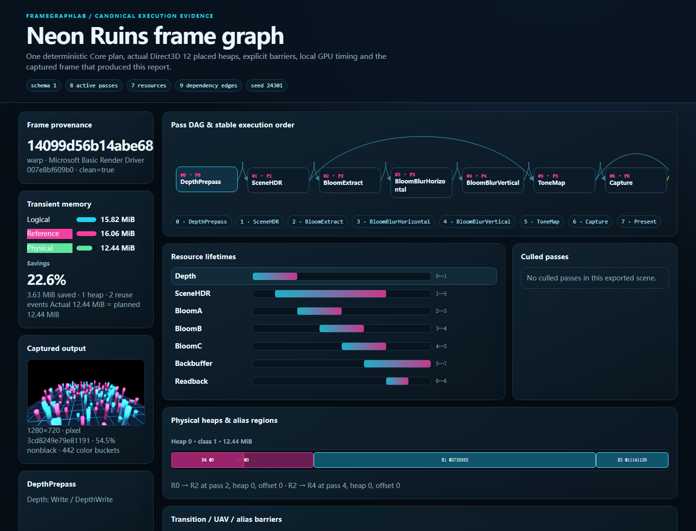

# FrameGraphLab

C++23 render graph compiler and native Direct3D 12 transient-memory laboratory.

```text
Declarative Passes → Dependency + Lifetime Compile → Transient Heap Aliasing
                  → Automatic D3D12 Barriers → Compute Culling / ExecuteIndirect
                  → HDR / Bloom / Tone Map
                  → GPU Timing + Inspector + Packaged Evidence
```

Version 0.1 is a release candidate under final verification. The pure compiler/planner, native hardware/WARP executor, actual placed-resource aliasing and procedural HDR demo are implemented. See the [product contract](tasks/20260904-184500-framegraph-dx12-0.1/product_contract.md) and [progress](tasks/20260904-184500-framegraph-dx12-0.1/progress.md) for exact gate status.


The scene uses D32 depth, RGBA16F HDR, threshold extraction, separable bloom and fullscreen tone mapping. A graph-declared compute pass frustum-culls 160 procedural pillars into a visible-instance buffer and draw arguments consumed by `ExecuteIndirect`. A CPU reference path is available for count and same-adapter pixel parity. No art assets are required.



The [self-contained sample Inspector](viewer/framegraph-inspector.html) embeds the real canonical plan, runtime report and screenshot. It shows DAG order, lifetimes, physical offsets, alias chains, barriers, memory and local pass timings, with linked pass/resource selection.

## Baseline build

Requires Python 3 for build-contract checks, C++23, and MSVC x64. MQB is the primary local Windows build/run entry. CMake 3.28+/CTest provide cross-platform Core, install/export and CI. Windows runtime additionally requires the Windows SDK.

```powershell
./scripts/build.ps1 core -Configuration debug
./scripts/build.ps1 compiler_tests -Configuration debug -Run
./scripts/build.ps1 planner_tests -Configuration debug -Run
./scripts/build.ps1 property -Configuration release -Run --cases 100000
./scripts/build.ps1 benchmark -Configuration release -Run --samples 31 --iterations 1000
```

## Shortest demo and smoke

```powershell
# Hardware, visible and interactive
./scripts/build.ps1 app -Configuration release -Run --hardware

# WARP, hidden window, bounded capture/report/plan
./scripts/build.ps1 app -Configuration release -Run --warp --headless --frames 240 --scene-seed 24301 --capture smoke.png --report smoke.json --plan plan.json

# CPU reference draw path for culling comparison
./scripts/build.ps1 app -Configuration release -Run --warp --headless --frames 1 --draw-mode cpu --report cpu-reference.json
```

Verified 1280x720 PACT-70 hardware observation: 16,589,456 logical bytes, 17,825,792 reference requirements and 13,893,632 actual resource-heap bytes with aliasing, saving 3,932,160 bytes (22.06%). A 120-frame fixed-seed run kept CPU/GPU visible counts equal and reported a 0.0221 ms local mean for the culling pass. Hardware and WARP each passed byte-exact CPU-direct/GPU-indirect and alias-on/off comparisons; hashes are deliberately not promised across adapters. Core evidence includes 97 focused unit cases, 100,000 valid + 100,000 invalid graph sweeps, 100,000 bounded mutations, MSVC Debug/Release, Clang, ASan+UBSan and canonical cross-compiler equality. Native Debug Layer results are 0 error / 0 unclassified warning / 0 corruption.

Current known boundaries are whole-resource state tracking, one direct queue, no async compute, no subresource tracking, no MSAA/small-placement alignment, and source-only GitHub distribution. Local Win64 packaging and clean extraction remain mandatory even though large binaries will not be attached to a future release. See [known limitations](docs/KNOWN_LIMITATIONS.md), [testing](docs/TESTING.md) and [AI assistance](docs/AI_ASSISTANCE.md) as they land in final verification.

This is AI-assisted engineering. The user defined the product, scope and acceptance requirements; Codex is implementing and verifying the delivery. See the task contract for authorship boundaries.

See [build policy](docs/BUILDING.md) for shared MQB/CMake configuration and portable commands. Local binary packaging and clean-extraction validation remain required delivery gates. A future authorized GitHub release will be source-only; it will not attach a precompiled demo, avoiding large binary transfers. Current graphics/package status remains pending in the progress record.
